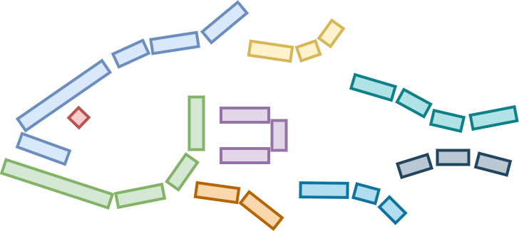
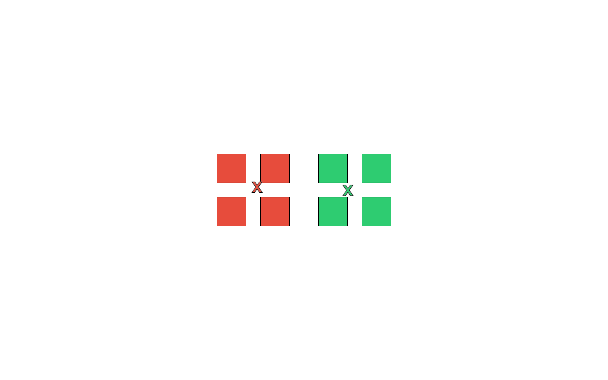
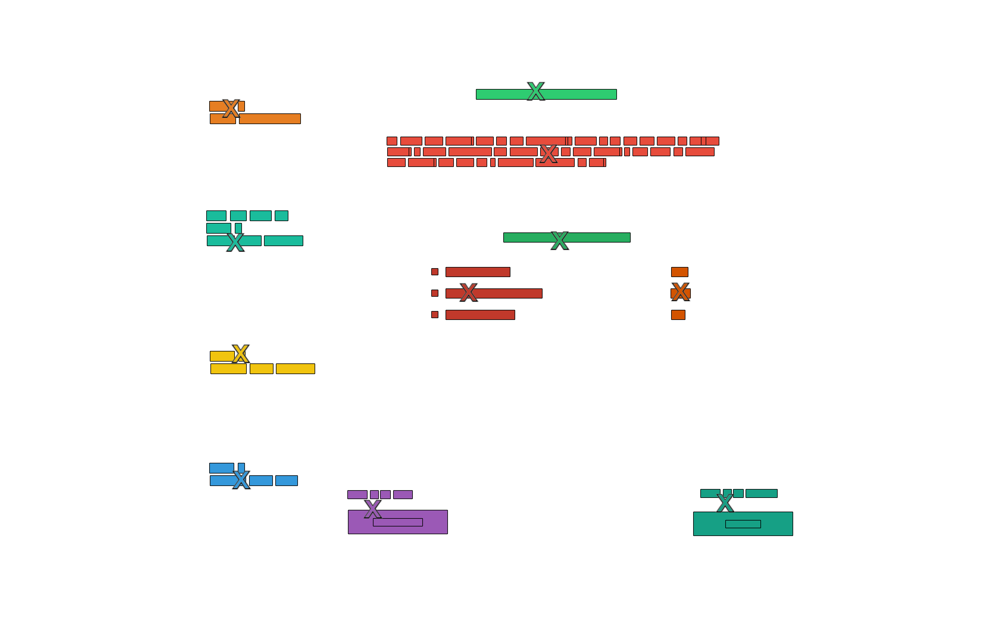

# Grouper: A paradigm for the experimental investigation of human visual grouping processes. 

experimental task written in pyglet for investigating human visual grouping processes with orthogonal boxes

## Running Grouper

### Dependencies 
Python 3.X
Pyglet

### Command line

> python3 grouper.py

or simply

> python grouper.py

### Task controls

- Spacebar / enter

- Click

- Click and drag

- Backspace / Delete (Mac)

## Input Files

### Experiment definition files

### Instruction defintion files

### Scene files

#### json

#### xml (draw.io)

## Output files

### Events file

### Trials file

### Scene file

### Screenshots

